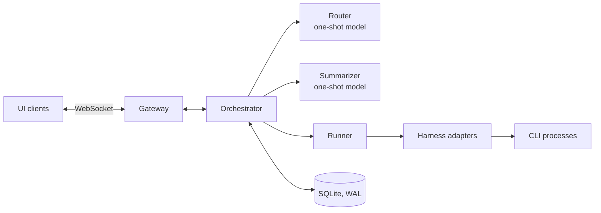
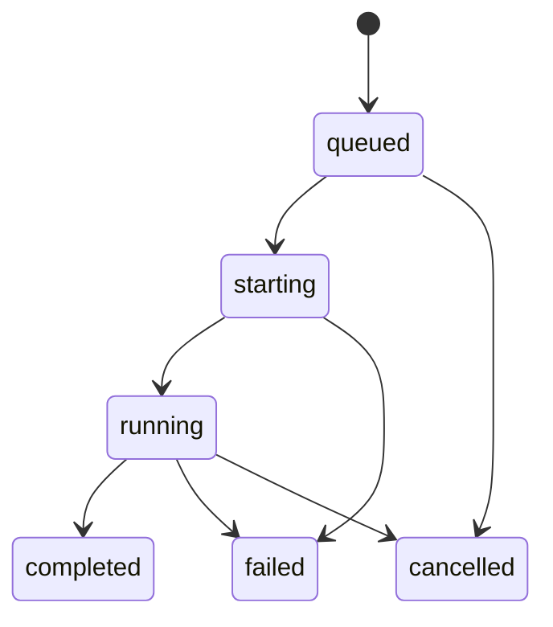

# Multi-Agent Workspace — Backend Spec

2026-09-21 · @Someone

## Overview

A local, Slack-style workspace where each agent is a specialist backed by an installed CLI harness (Claude Code, Codex, opencode) run in non-interactive mode. Humans DM agents or add them to channels. The backend owns history, routing, sessions and streaming, and renders the harnesses' JSON tool calls and responses to the UI.

Agents are general companions, not only coding agents: they research, write code, and organize files anywhere on the user's machine.

This spec covers the backend: data model, orchestration, sessions, process management and the streaming protocol. The frontend is out of scope.

Design principles:

- The per-channel event log is the single source of truth. The UI, deltas, checkpoints and audits all read from it.
- Harness differences stop at the adapter. Everything above it sees one normalized event type.
- Agents are config rows. A new specialist is an insert, not code.
- Hot resume and cold rebuild share one code path and differ only in the starting seq.

## Core concepts

| Concept | Definition |
| --- | --- |
| Agent | A config row: harness, model, system prompt, allowed tools, default cwd, permission mode, one-line description. |
| Channel | A named conversation with human and agent members, its own cwd and its own event log. |
| DM | A channel of kind `dm` with one human and one agent. No router. One long-lived context, reset only by `/new`. |
| Event | An immutable, append-only record in a channel's log, ordered by a per-channel `seq`. |
| Run | One harness invocation for one agent in one channel. The unit of work, cancellation and cost. |
| Session | The link between an `(agent, channel)` pair and the harness's own resumable session. |
| Router | A built-in, one-shot model call that picks agents for unmentioned human messages in channels. Not a CLI. |
| Delta | The slice of the channel log rendered into a run's prompt, bounded by `delta_start_seq` and `delta_end_seq`. |
| Checkpoint | A summary event that bounds the size of a cold rebuild. |
| Chain | All events descending from one human message, tracked by `chain_id` and `hop` to stop agent loops. |

## System components

One orchestrator process owns all writes. Clients talk to it over a WebSocket gateway, and it spawns one CLI process per run through a harness adapter.



| Component | Responsibility |
| --- | --- |
| Gateway | WebSocket connections, cursor replay, fan-out of durable events and ephemeral text deltas. |
| Orchestrator | One mailbox per channel. Allocates `seq`, applies routing rules, queues, resolves sessions, renders deltas, records runs. |
| Router | In-process one-shot API call behind a `Router` interface. Returns the agents to dispatch, possibly none. |
| Summarizer | In-process one-shot API call. Writes rolling checkpoints asynchronously. |
| Runner | `start(turn) -> AsyncIterator<NormalizedEvent>` and `cancel(reason)`. Spawn per turn in v1. |
| Harness adapters | One per CLI. Probe version, build argv, parse NDJSON, emit normalized events. |
| Store | SQLite in WAL mode. Single writer per channel through the orchestrator. |

## Data model

Seven tables. The event log and the runs table carry the system; the rest is configuration and bookkeeping.

```sql
agents(
  agent_id        TEXT PRIMARY KEY,
  handle          TEXT UNIQUE,      -- used in @mentions
  name, description,                -- description feeds the router roster
  harness         TEXT,             -- claude_code | codex | opencode
  model, system_prompt,
  allowed_tools   JSON,
  default_cwd     TEXT NULL,
  permission_mode TEXT,             -- v1: bypass
  created_at, updated_at
)

channels(
  channel_id      TEXT PRIMARY KEY, -- ULID
  kind            TEXT,             -- channel | dm
  name,
  cwd             TEXT,             -- absolute, immutable after creation
  cwd_managed     BOOL,
  next_seq        INTEGER,
  rendered_chars_since_checkpoint INTEGER,
  created_at, archived_at
)

channel_members(
  channel_id, member_kind,          -- human | agent
  member_id, joined_at,
  PRIMARY KEY (channel_id, member_kind, member_id)
)

events(
  id          INTEGER PRIMARY KEY AUTOINCREMENT, -- global WS cursor
  channel_id  TEXT,
  seq         INTEGER,              -- per-channel order
  ts, kind, author_kind, author_id,
  run_id      TEXT NULL,
  chain_id    INTEGER,              -- events.id of the originating human message
  hop         INTEGER,
  payload     JSON,
  UNIQUE (channel_id, seq)
)

runs(
  run_id, channel_id, agent_id,
  trigger_seq,                      -- highest seq that caused this run
  delta_start_seq, delta_end_seq,
  session_mode,                     -- resume | cold
  harness, harness_session_id, cwd, pgid,
  status, error, exit_code,
  started_at, ended_at,
  tokens_in, tokens_out, cost_usd,
  UNIQUE (channel_id, trigger_seq, agent_id)
)

agent_sessions(
  agent_id, channel_id,
  harness, harness_session_id, cwd,
  last_seen_seq,
  config_fingerprint,               -- hash(harness, model, system_prompt, tools)
  last_run_status,                  -- clean | dirty
  last_used_at,
  PRIMARY KEY (agent_id, channel_id)
)

dispatch_queue(
  queue_id    INTEGER PRIMARY KEY,
  channel_id, event_seq,
  agent_id    TEXT NULL,            -- NULL until routed
  wait_for    JSON,                 -- run_ids that must terminate first
  state,                            -- awaiting_route | awaiting_agent | dispatched | dropped
  created_at
)
```

`dispatch_queue` makes queued work survive a restart. The `runs` unique key makes dispatch idempotent, so replaying the queue never spawns twice.

## Event log

The log is append-only and never rewritten. Session validity, delta ranges and checkpoints all depend on events not changing under them.

| Kind | Author | Payload | Notes |
| --- | --- | --- | --- |
| `message` | human, agent, system | `{text, mentions[]}` | Final text only. Streaming deltas are never stored. |
| `tool_call` | agent | `{tool_call_id, name, input}` | Written as it arrives. |
| `tool_result` | agent | `{tool_call_id, output, is_error, bytes}` | Output capped at the adapter; full size recorded in `bytes`. |
| `run_status` | system | `{run_id, status, error?}` | Exactly one terminal status per run. |
| `routing_decision` | system | `{for_seqs[], agents[], reason, error?}` | Emitted every time the router runs, including empty picks. |
| `context_reset` | human | `{}` | Emitted by `/new`. |
| `context_checkpoint` | system | `{covers_through_seq, summary}` | See Checkpoints. |
| `message_edit` | human | `{target_seq, text?, deleted?}` | Applied at render time. |
| `system` | system | `{code, text}` | Notices such as a stopped chain. |

Rules:

- `seq` is allocated by the channel's mailbox, one writer per channel. `UNIQUE(channel_id, seq)` turns a concurrency bug into a failed insert instead of silent reordering.
- `id` is a global autoincrement used only as the WebSocket resume cursor.
- Edits and deletes are new events. The original row is never updated.
- Every event carries `chain_id` and `hop` from the human message that started its chain.

## Routing and dispatch

Mentions always win; the router runs only on unmentioned human messages in channels. Rules apply in order:

| Incoming event | Dispatch |
| --- | --- |
| Human message in a DM | The DM's agent. Router never runs. |
| Human message in a channel with mentions | Every mentioned agent, in parallel. Router never runs. |
| Human message in a channel without mentions | Router decides. |
| Agent message mentioning another agent | That agent, with `hop + 1`. Past `max_hops`, emit a `system` event and dispatch nobody. |
| Agent message without mentions | Nobody. The router never runs on agent messages. |

Proposed `max_hops`: 3.

### Queueing

The queue key is `(agent_id, channel_id)`. One run at a time per key; different agents in the same channel run in parallel.

- A message for a busy agent is appended to the log immediately and queued. When that agent's run terminates, all queued messages for the key are coalesced into one turn.
- A message for an idle agent dispatches immediately, even while other agents in the channel are running.
- An unmentioned message that arrives while runs are active in the channel is held with `wait_for` set to those run ids. It is routed once every one of them has terminated, so the router sees their replies first. Held messages coalesce into one router call.
- If the router picks a busy agent, the message moves to `awaiting_agent` for that key.
- No mid-run steering in v1.

### Router contract

Input: the roster (agent id, handle, one-line description, idle or busy), the last N rendered events, and the messages being routed.

Output: strict JSON.

```json
{"agents": ["agent_id"], "reason": "short text"}
```

- An empty `agents` list is a valid answer and is common in busy channels.
- Short timeout, one retry. On error, timeout or unparseable output it fails closed: dispatch nobody and emit `routing_decision` with `error`.
- A `routing_decision` event is emitted on every call so silence is visible in the UI and routing quality can be measured later.
- Sits behind a `Router` interface so a rules-based implementation can replace it.

## Run lifecycle

Every run ends in exactly one terminal state, and that state decides whether the agent's session can be resumed.



`starting` covers session resolution, delta rendering and spawn. `running` begins at the first output from the harness.

| Transition | Session effect |
| --- | --- |
| `starting → failed` | None. The harness never ran, so a clean session stays clean. |
| `running → completed` | `last_run_status = clean`, `last_seen_seq = delta_end_seq`, `harness_session_id` updated from the run. |
| `running → failed` | `last_run_status = dirty`. Next turn is a cold rebuild. |
| `running → cancelled` | `last_run_status = dirty`. Next turn is a cold rebuild. |

Rules:

- `delta_start_seq` and `delta_end_seq` are captured at dispatch, before spawn. Messages that arrive during the run have higher seqs and land in the next turn.
- On completion, `last_seen_seq` takes `delta_end_seq`, never the channel's current max seq. Using the max silently drops queued messages.
- `last_seen_seq` advances only after the terminal event is committed.
- `trigger_seq` is the highest seq in the coalesced batch that caused the run.

## Conversation state

Hybrid: resume the harness's own session when it is still valid, otherwise cold-rebuild from our log. Our log stays canonical either way.

A turn resumes only if all of these hold:

- An `agent_sessions` row exists for the pair.
- The harness's session artifact is still on disk.
- `config_fingerprint` matches the agent's current config.
- `cwd` matches the channel's cwd.
- No `message_edit` targets a seq at or below `last_seen_seq` since the last clean run.
- No `context_reset` exists after `last_seen_seq`.
- `last_run_status = clean`.
- Optional: `last_used_at` is within a TTL.

| Mode | Harness call | Prompt |
| --- | --- | --- |
| Resume | Harness resume flag with `harness_session_id` | `render_delta` from `last_seen_seq + 1` to `delta_end_seq` |
| Cold | New harness session | Latest checkpoint summary, then `render_delta` from its `covers_through_seq + 1` (or the latest `context_reset`) to `delta_end_seq` |

Both modes call the same `render_delta` function with a different starting seq. Cold rebuild is a routine path, not error handling.

DMs keep one long-lived context per agent. It continues indefinitely through harness compaction and our checkpoints, and resets only on `/new`.

## Delta rendering

`render_delta(agent_id, channel_id, from_seq, to_seq, mode)` is deterministic: the same log and range always produce the same prompt, so any run can be replayed exactly.

```
<channel name="#rankmesh" new_since="412">
[siddique] the retry logic in the poll loop looks wrong
[codex:backend] (ran 4 tools: read x2, grep, edit)
[codex:backend] the merge happens after all platforms return, so one
failure raises before any results are written
</channel>
```

| Content | Resume mode | Cold mode |
| --- | --- | --- |
| Human messages | Included | Included |
| Other agents' messages | Included | Included |
| Other agents' tool calls | Collapsed to one count line | Collapsed to one count line |
| This agent's own messages | Excluded, already in harness context | Included |
| This agent's own tool calls | Excluded | Collapsed to one count line |
| `run_status`, `routing_decision` | Excluded | Excluded |
| Edits | Applied as of `to_seq` | Applied as of `to_seq` |

The agent's system prompt, not the delta, states that its cwd is a home base and that it may read and write elsewhere.

## Checkpoints and context reset

A channel is checkpointed when its cold-mode rendered size since the last checkpoint passes 100,000 characters. This bounds every cold rebuild to one summary plus 25,000 to 100,000 characters of raw recent events.

```
[ checkpoint N-1 ][ ---- summarized now ---- ][ raw tail ~25k ]
                                             ^ covers_through_seq
```

- Measure rendered size, not raw log size. `channels.rendered_chars_since_checkpoint` is incremented as events are appended, so the check is a column read.
- Summarize the older portion and leave about 25,000 characters raw, so a cold rebuild still has the exact wording of recent exchanges.
- Rolling: the new summary is produced from the previous summary plus the newly covered events. Cap the summary at about 10,000 characters.
- The `context_checkpoint` payload carries `covers_through_seq`. Rendering resumes from that value, never from the checkpoint event's own seq, because messages keep arriving while the summary is written.
- Runs asynchronously after a run completes, off the dispatch path. A cold rebuild during summarization uses the previous checkpoint.
- The summarizer preserves open tasks and their owners, decisions and who made them, paths and artifacts touched, user constraints and preferences, and unresolved questions.
- Checkpoints never affect resumed sessions. They matter only when a session invalidates.

### /new

`/new` emits a `context_reset` event. Any session whose `last_seen_seq` is below it becomes invalid, so the next turn is a cold rebuild starting at the reset. The log stays continuous and scrollable. The counter resets to 0, and a checkpoint never summarizes across a reset. In a channel, a reset applies to every agent in it.

## Process management

One CLI process per turn, in its own process group, killed as a group.

- Spawn with `setsid` so the harness and any subprocesses it starts (MCP servers, shells) share a new process group. Store `pgid` on the run.
- Cancel sends `SIGTERM` to `-pgid`, then `SIGKILL` after a grace period (proposed 5 s), then reaps.
- Drain stdout on a dedicated task from the first byte. A child that fills the pipe buffer while the reader is busy deadlocks.
- Cap NDJSON line length at the adapter (proposed 1 MB). Tool results carrying file contents can arrive as multi-megabyte single lines.
- Capture stderr to a per-run log for debugging. It is not part of the event stream.
- A global semaphore caps concurrent runs (value to be set).
- The `Runner` interface is `start` and `cancel` only. A warm process pool can replace spawn-per-turn later without changing the orchestrator.

## Workspaces and cwd

Each channel has one cwd shared by all its agents. It is a home base, not a boundary: agents may read and write anywhere on the machine.

| Case | cwd |
| --- | --- |
| Channel, default | `~/.<app>/workspaces/<channel_id>/`, created lazily on the first run |
| Channel, override | An absolute path chosen at creation, such as an existing repo |
| DM | The agent's `default_cwd` if set, otherwise a managed directory like any channel |

- The path is keyed by `channel_id`, never by name, and stored as an absolute path that is immutable after creation. Claude Code namespaces sessions by directory, so a cwd change would orphan every session in the channel.
- Archiving or deleting a channel never deletes its directory.
- No git init or auto-commit. Agents are general companions, not only coding agents.
- Agents in one channel run in parallel on the same cwd, so concurrent writes to the same file are possible. The UI shows which agents are active in a channel.

## Harness adapters

Each adapter is the only code that knows its CLI's flags and output shape. It turns NDJSON lines into normalized events.

```
Adapter.probe()                      -> {version, capabilities}
Adapter.build_command(turn, session) -> {argv, env, cwd}
Adapter.parse(line)                  -> NormalizedEvent[]
```

`probe` runs at startup and validates the flags the adapter relies on. Flag surfaces change between releases, so a mismatch should fail at boot rather than inside a user's turn.

| Harness | Invocation (indicative, verify with probe) | Resume |
| --- | --- | --- |
| Claude Code | `claude -p --output-format stream-json --verbose`, permissions bypassed | `--resume <session_id>` |
| Codex | `codex exec --json`, approvals and sandbox bypassed | `codex exec resume <session_id>` |
| opencode | `opencode run` with JSON output | Session id flag |

### Normalized events

| Event | Fields | Persisted as |
| --- | --- | --- |
| `run_started` | `harness_session_id?` | Updates the run row |
| `text_delta` | `text` | Not persisted. Broadcast only. |
| `message` | `text` | `message` event |
| `tool_call` | `tool_call_id, name, input` | `tool_call` event |
| `tool_result` | `tool_call_id, output, is_error, bytes` | `tool_result` event |
| `usage` | `tokens_in, tokens_out, cost_usd?` | Accumulated on the run row |
| `run_finished` | `ok, error?` | Terminal `run_status` event |

## Streaming and WebSocket protocol

Durable events and ephemeral text deltas travel on the same socket but are handled differently: events are replayable by cursor, deltas are live only.

- On connect the client sends `{last_id}`. The server replays events with `id > last_id` in every channel the user belongs to, then streams live.
- If the gap exceeds a cap (proposed 5,000 events), the server sends `resync` and the client refetches per channel instead.
- Scrollback is a paginated query on `(channel_id, seq)`.
- The orchestrator holds each in-flight run's partial message in memory. A client that connects mid-run receives a `partial_snapshot` for it, then live deltas.
- If the orchestrator dies mid-run, the partial is lost and the run is marked orphaned on boot.

| Direction | Message | Payload |
| --- | --- | --- |
| Server → client | `event` | A durable event row |
| Server → client | `delta` | `{run_id, channel_id, text}` |
| Server → client | `partial_snapshot` | `{run_id, channel_id, text}` |
| Server → client | `resync` | `{channels[]}` |
| Client → server | `send_message` | `{channel_id, text, mentions[]}` |
| Client → server | `edit_message` | `{channel_id, target_seq, text?, deleted?}` |
| Client → server | `cancel_run` | `{run_id}` |
| Client → server | `new_context` | `{channel_id}` |

## Failure handling

Every failure ends in a committed terminal event and a known session state. Nothing is left pending indefinitely.

| Failure | Handling |
| --- | --- |
| Orchestrator restart | For each run not in a terminal state: kill its `pgid` if alive (stdout cannot be reattached), mark it `failed` with reason `orphaned`, mark the session dirty, emit the terminal event. Then replay `dispatch_queue`. |
| Spawn fails | `starting → failed`. Session unchanged. |
| Harness exits non-zero | `running → failed`. Session dirty. |
| User cancels | `running → cancelled`. Session dirty. |
| Router error, timeout or bad JSON | `routing_decision` with `error`. Nobody dispatched. |
| Session artifact missing | Cold rebuild. Not an error. |
| Summarizer fails | Keep the previous checkpoint. Retry after the next completed run. |
| Hop limit reached | `system` event on the chain. Nobody dispatched. |
| Duplicate dispatch after restart | Rejected by `UNIQUE(channel_id, trigger_seq, agent_id)`. |

## Deferred and open items

| Item | Status |
| --- | --- |
| Guardrails for dangerous commands | Deferred. Agents run with permissions bypassed in v1. |
| Mid-run steering | Deferred. Messages queue until the turn completes. |
| Warm process pool | Deferred. Fits behind the `Runner` interface. |
| Git or undo for workspaces | Not planned. |
| Frontend | Separate spec. |

Values to set before implementation:

- [ ] `max_hops` for agent-to-agent chains (proposed 3)
- [ ] Tool output cap stored per `tool_result`
- [ ] Concurrent run limit
- [ ] WebSocket replay cap (proposed 5,000 events)
- [ ] Session TTL, if any
- [ ] Router timeout and N events of context
- [ ] Models for the router and summarizer
